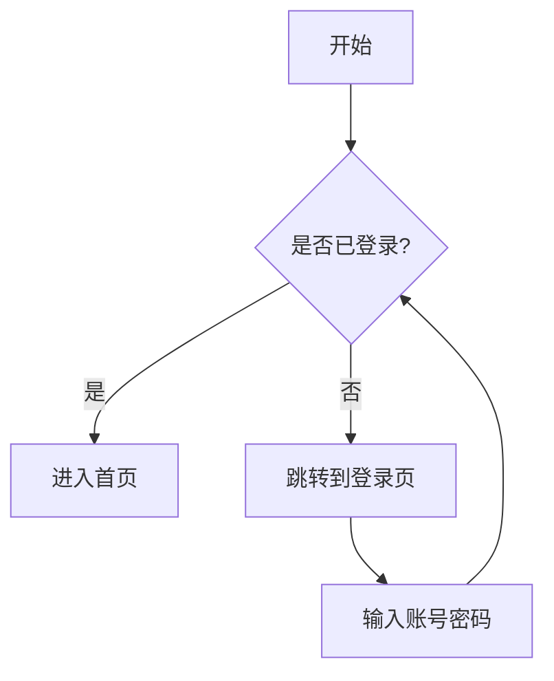

# Markdown 写作完全指南：从入门到精通

> 一篇搞定 Markdown 写作，附赠 VS Code 编辑器配置方案

你是否曾经遇到过这些问题：写的技术文档排版混乱、代码没有高亮、想加个流程图却无从下手、图片插入后找不到文件？如果你对这些问题感同身受，那么这篇文章正是为你准备的。

我将从一个零基础写作者的角度出发，带你系统掌握 Markdown 的写作方法，并用 VS Code 搭建一套专业的写作环境。全文约 **5000 字**，建议先收藏，再跟着操作。

---

## 第一章：什么是 Markdown？为什么你一定要学会它？

### 1.1 Markdown 是什么？

Markdown 是一种**轻量级标记语言**，由 John Gruber 于 2004 年创建。它的核心理念是：

> **"可读性即源码"**

意思就是：你用 Markdown 写出来的文档，即使在纯文本状态下（没有经过任何渲染），也应该清晰可读、层级分明。它不像 Word 那样需要关注字体、字号、颜色，你只需要关注**内容结构**本身。

简单来说，Markdown 就是用几个简单的符号（如 `#`、`*`、`-`）来标记文章的标题、列表、加粗等格式。写完后，通过渲染工具就能一键转换成漂亮的 HTML、PDF 等格式。

### 1.2 为什么要学 Markdown？

| 场景 | Markdown 的优势 |
| :--- | :--- |
| **技术文档写作** | GitHub、GitLab、GitBook 等平台原生支持，README 文件的标准格式 |
| **笔记与知识管理** | Obsidian、Notion、语雀等笔记软件均支持，笔记永久可读，不会被软件绑架 |
| **博客写作** | 几乎所有静态博客框架（Hexo、Hugo、VuePress）都基于 Markdown |
| **学术写作** | 支持 LaTeX 数学公式和文献引用，Zettlr 等工具专为此设计 |
| **团队协作** | 纯文本格式，Git 版本追踪友好，diff 对比清晰 |

**一句话总结**：Markdown 是当代写作者的"普通话"，学会它，你可以在任何平台、任何工具间自由迁移你的文字。

---

## 第二章：Markdown 基础语法（必学 15 分钟）

> 这一章是 Markdown 的"九九乘法表"，花 15 分钟记住，终身受用。

### 2.1 标题

Markdown 支持六级标题，对应 HTML 的 `<h1>` 到 `<h6>`。

```markdown
# 一级标题（通常是文章大标题）
## 二级标题（章节标题）
### 三级标题（小节标题）
#### 四级标题
##### 五级标题
###### 六级标题
```

规则：`#` 和标题文字之间必须有一个空格。否则 `#标题` 会被当作普通文本的 `#` 符号。

### 2.2 段落与换行

段落：用空行分隔两个段落。

换行：在一行末尾加两个空格，然后按回车；或者直接用一个空行来分段。

```markdown
这是第一段。段落后跟一个空行。

这是第二段。

这是第一行（末尾有两个空格）  
这是第二行（紧接上一行换行）
```

### 2.3 强调（加粗、斜体、删除线）

| 效果 | 语法 | 示例 |
| :--- | :--- | :--- |
| 加粗 | `**文字**` 或 `__文字__` | `**重要内容**` → **重要内容** |
| 斜体 | `*文字*` 或 `_文字_` | `*强调*` → *强调* |
| 加粗斜体 | `***文字***` | `***非常重要***` → ***非常重要*** |
| ~~删除线~~ | `~~文字~~` | `~~废弃内容~~` → ~~废弃内容~~ |

推荐统一使用 `**` 和 `*`，兼容性更好，且不容易与英文单词中的下划线 `_` 混淆。

### 2.4 列表

无序列表（用 `-`、`+` 或 `*`）：

```markdown
- 苹果
- 香蕉
  - 海南香蕉（缩进 2 或 4 空格表示子级）
  - 台湾香蕉
- 橙子
```

有序列表（数字 + `.`）：

```markdown
1. 第一步：打开冰箱门
2. 第二步：把大象放进去
3. 第三步：关上冰箱门
```

技巧：有序列表的数字序号不必真实，全部写成 `1.` 也可以，Markdown 渲染时会自动递增。

### 2.5 链接与图片

链接：

```markdown
[显示文字](https://example.com "鼠标悬停提示文字")
```

示例：`[Google](https://www.google.com)` → Google

图片：

```markdown

```

示例：``

区分技巧：图片和链接的区别就是前面多了一个 `!`，记住"感叹号加方括号"就是图片。

### 2.6 引用（Blockquote）

用于引用他人的文字、标注重要信息或回复邮件场景。

```markdown
> 这是一段引用文字。
> 可以跨行。
>> 嵌套引用（两个 > 号）
```

渲染效果：

> 这是一段引用文字。可以跨行。
>> 嵌套引用（两个 > 号）

### 2.7 代码

行内代码（包裹变量名、函数名、短命令）：

```markdown
请使用 `npm install` 命令安装依赖包。
```

代码块（多行代码，必须指定语言以实现语法高亮）：

```markdown
```javascript
const hello = 'Hello, World!';
console.log(hello);
```

```python
def greet(name):
    return f"Hello, {name}!"
```
```

⚠️ 极其重要：代码块后面紧跟的那个单词（`javascript`、`python`）表示编程语言，务必填写，否则代码没有高亮，阅读体验大打折扣。

---

## 第三章：进阶排版技巧（让你的文档更专业）

掌握了基础语法，你已经能写出 80% 的日常文档了。下面这些技巧，能让你的文档从"能用"升级到"专业"。

### 3.1 表格

```markdown
| 左对齐 | 居中对齐 | 右对齐 |
| :--- | :---: | ---: |
| 内容1 | 内容2 | 内容3 |
| 内容4 | 内容5 | 内容6 |
```

| 左对齐 | 居中对齐 | 右对齐 |
| :--- | :---: | ---: |
| 内容1 | 内容2 | 内容3 |
| 内容4 | 内容5 | 内容6 |

对齐规则：

- `:---` = 左对齐
- `:---:` = 居中对齐
- `---:` = 右对齐

### 3.2 任务清单（To-Do List）

特别适合项目管理和笔记场景，在 GitHub、GitLab 等平台上可交互勾选。

```markdown
- [x] 已完成需求分析
- [x] 已完成数据库设计
- [ ] 正在开发登录模块
- [ ] 待测试
```

渲染后：

- [x] 已完成需求分析
- [x] 已完成数据库设计
- [ ] 正在开发登录模块
- [ ] 待测试

### 3.3 脚注

对专有名词或术语做补充说明，不影响正文阅读流畅度。

```markdown
Markdown 是由 John Gruber[^1] 在 2004 年创建的。

[^1]: John Gruber 是著名的博客作者和 UI 设计师。
```

### 3.4 分隔线

单独成行，用来分割不同主题的内容。

```markdown
---
```

或者

```markdown
***
```

建议统一使用 `---`，输入最快。

### 3.5 转义字符

如果你需要显示 `#`、`*`、`_` 等特殊符号，前面加反斜杠 `\` 即可。

```markdown
\# 这不是标题，而是一个普通的 # 符号
\* 这不是列表，而是星号
```

---

## 第四章：终极杀手锏——图表与公式

现代 Markdown 编辑器（如 VS Code + Markdown Preview Enhanced、Typora、Obsidian）普遍支持以下高级功能。

### 4.1 Mermaid 流程图

```markdown

```

渲染后效果（此处为示意）：

[开始] → {是否已登录?} → 是 → [进入首页]；否 → [跳转到登录页] → [输入账号密码] → 回到 {是否已登录?}

支持的图表类型：流程图 (graph)、时序图 (sequenceDiagram)、甘特图 (gantt)、类图 (classDiagram)、状态图 (stateDiagram) 等。

### 4.2 数学公式（LaTeX）

行内公式：`$E = mc^2$` → E=mc²

块级公式：

```markdown
$$
\int_{-\infty}^{\infty} e^{-x^2} dx = \sqrt{\pi}
$$
```

∫_{-∞}^{∞} e^{-x²} dx = √π

这项功能对学术写作和理工科笔记尤为实用。

### 4.3 自动生成目录（TOC）

对于超过 500 行的长文档，目录必不可少。

手动写法：

```markdown
## 目录
- [第一章：什么是 Markdown](#第一章什么是-markdown)
  - [1.1 Markdown 是什么](#11-markdown-是什么)
  - [1.2 为什么要学 Markdown](#12-为什么要学-markdown)
```

自动化方案（推荐）：使用 Markdown All in One 插件，右键选择 "Create Table of Contents"，一键生成，修改标题后更新即可。

---

## 第五章：VS Code 写作环境搭建（实战篇）

既然你已经读到了这里，说明你是认真想学的。接下来我将手把手教你用 VS Code 搭建一套专业的 Markdown 写作环境。

### 5.1 安装 VS Code

如果你还没安装 VS Code，去 [code.visualstudio.com](https://code.visualstudio.com) 下载对应操作系统的版本（Windows / macOS / Linux），一路默认安装即可。

### 5.2 安装两个核心插件

打开 VS Code，点击左侧活动栏的扩展图标（或按 `Ctrl+Shift+X`），分别搜索并安装以下两个插件：

| 插件名称 | 作者 | 作用 |
| :--- | :--- | :--- |
| Markdown All in One | Yu Zhang | 编辑增强：自动生成目录、快捷键、列表自动补全 |
| Markdown Preview Enhanced | Yiyi Wang | 超强预览 + 导出 PDF/HTML/PNG + Mermaid + LaTeX |

✅ 认准作者和安装量（第一个都是上千万安装量的正主），不要装错了。

### 5.3 开始写你的第一篇 Markdown 文档

1. 新建文件：`Ctrl+N` → 保存为 `我的第一篇.md`（文件名以 `.md` 结尾）。
2. 打开预览：按 `Ctrl+Shift+V` 打开实时预览窗口。你在这边写，那边实时更新。

写点内容试试：

```markdown
# 你好，Markdown！

这是我的第一篇 Markdown 文档。

## 今天学到了什么

- 如何写标题
- 如何**加粗**和写*斜体*
- 如何插入[链接](https://www.baidu.com)

## 下一章预告

明天学习表格和流程图！
```

你会发现右侧预览区已经渲染出了漂亮的排版效果——这就是 Markdown 的魔力。

### 5.4 插入图片的四种方法

这是高频操作，单独重点说明：

| 方法 | 操作 | 适用场景 |
| :--- | :--- | :--- |
| ① 手写路径 | `` | 最标准，推荐日常使用 |
| ② 拖拽文件 | 从文件夹拖图片到编辑器 | 省去打字，最直观 |
| ③ 粘贴截图（需插件） | 安装 Paste Image 插件，截图后按 `Ctrl+Alt+V` | 写技术文档最高效 |
| ④ HTML 调整尺寸 | `` | 图片太大需要缩放时 |

⚠️ 重要规则：图片路径请一律使用正斜杠 `/`（即使你在 Windows 上），并且使用相对路径（如 `./images/a.png`），不要用 `C:\Users\...` 这样的绝对路径，否则上传到 GitHub 后图片会裂开。

### 5.5 导出为 PDF / HTML

安装了 Markdown Preview Enhanced 后，在预览区域右键 → 选择 "Export" → 选择 PDF 或 HTML 即可导出。

注意：导出 PDF 可能需要额外安装 Princexml 或 Pandoc 作为转换引擎，具体安装方法插件页面有详细说明。

---

## 第六章：排版规范（专业人士的"体面"）

写技术文档就像穿衣服，语法正确只是"没穿反"，而遵守排版规范才是"穿得体面"。以下规则通用于所有中文技术写作场景。

### 6.1 中英文混排（盘古之白）

这是最常见也最容易犯的错误。核心原则：**中英文之间加空格，中文与数字之间加空格。**

| ❌ 错误写法 | ✅ 正确写法 |
| :--- | :--- |
| 这是一个iPhone手机 | 这是一个 iPhone 手机 |
| 今天有3个人报名 | 今天有 3 个人报名 |
| 请使用VS Code打开 | 请使用 VS Code 打开 |
| 下载Node.js v18版本 | 下载 Node.js v18 版本 |

### 6.2 标点符号规范

- 中文内容使用全角标点：，。！""《》（）
- 英文或代码部分保留半角标点：, . ! " " ' '

示例：

✅ 他说："请运行 `npm install` 命令，然后启动项目。"

### 6.3 专有名词大小写

- ✅ GitHub（不要写成 Github 或 github）
- ✅ JavaScript（不要写成 Javascript）
- ✅ TypeScript、React、Vue.js 等遵循官方写法

### 6.4 代码块语言标识

写代码块时，务必指定语言：

```markdown
```javascript    ← ✅ 有高亮
const a = 1;
```

```               ← ❌ 没有高亮，一团灰色
const a = 1;
```
```

### 6.5 文件命名规范

- 使用小写字母 + 短横线：`my-awesome-guide.md` ✅
- 不要使用空格或中文：`我的文档.md` ❌（虽然有些平台支持，但不规范）

---

## 第七章：完整文档示例

下面是一篇包含本文所有知识点的完整示例文档，你可以直接复制到 VS Code 中预览效果。

```markdown
# Markdown 写作完全指南

> 一份从零到精通的 Markdown 教程

**作者**：技术写作团队  
**更新日期**：2026 年 7 月 20 日

---

## 目录

- [第一章：什么是 Markdown](#第一章什么是-markdown)
- [第二章：基础语法](#第二章基础语法)
- [第三章：进阶技巧](#第三章进阶技巧)

---

## 第一章：什么是 Markdown

Markdown 是一种轻量级标记语言，由 John Gruber[^1] 于 2004 年创建。

### 为什么要学 Markdown？

- **纯文本**：任何编辑器都能打开，永不淘汰
- **易转换**：一键导出 PDF、HTML、Word
- **平台支持**：GitHub、Stack Overflow、Notion 等均支持

[^1]: John Gruber 是著名博客作者和 UI 设计师。

---

## 第二章：基础语法

### 2.1 标题

# 一级标题
## 二级标题
### 三级标题

### 2.2 列表

无序列表：

- 苹果
- 香蕉
  - 海南香蕉（子级）
  - 台湾香蕉
- 橙子

有序列表：

1. 第一步
2. 第二步
3. 第三步

---

## 第三章：图片与链接

### 图片


> 图片路径建议使用相对路径

### 链接
访问 [Google](https://www.google.com) 了解更多。

---

## 总结

| 章节 | 掌握程度 | 备注 |
| :--- | :--- | :--- |
| 基础语法 | ✅ 已完成 | 核心语法全部掌握 |
| 进阶技巧 | 🔄 学习中 | 表格和 Mermaid 待练习 |
| VS Code 配置 | ✅ 已完成 | 两个核心插件已安装 |
```

---

## 第八章：常见问题与避坑指南

| 问题 | 原因 | 解决方案 |
| :--- | :--- | :--- |
| 预览中标题没有变成大字号 | `#` 后面没加空格 | 改成 `# 标题` |
| 列表项间距太大 | 列表项之间有空行 | 删除空行，让列表连续 |
| 代码没有颜色（全是灰色） | 代码块没指定语言 | 写成 ` ```javascript ` |
| 换行没生效（挤在一行里） | Markdown 中直接回车不换行 | 末尾加两个空格后回车，或空行分段 |
| 图片预览裂了 | 路径写错了 | 检查文件名大小写，用相对路径 `/` |
| GitHub 上图片不显示 | 用了绝对路径（`C:/...`） | 改成相对路径 `./images/a.png` |
| 导出 PDF 失败 | 缺少转换引擎 | 安装 Princexml 或 Pandoc |

---

## 第九章：写在最后

### 9.1 给新手的三个建议

1. **先学基础，再学进阶**：先把标题、列表、链接、图片、代码块这五个语法练熟，足够应付 90% 的日常写作。表格、流程图等用到时再查不迟。
2. **用工具辅助规范**：在 VS Code 中安装 **markdownlint** 插件，它会自动检查你的语法错误和不规范写法，对新手极其友好。
3. **多读优秀的开源文档**：去 GitHub 上搜一些知名项目（如 Vue、React 的 README），看看那些大神是怎么写文档的——这是最好的学习素材。

### 9.2 推荐的写作流程


### 9.3 最后的几句话

Markdown 不仅仅是一门技术，更是一种写作思维方式——它让你关注内容本身，而非花哨的排版。当你习惯了用 Markdown 写作，你会发现自己的文字更清晰、结构更严谨、思路更有条理。

你现在已经掌握了从零到一的全部知识，剩下的就是动手写。

打开 VS Code，按下 `Ctrl+N`，保存为 `.md` 文件，然后开始写吧——你的第一篇 Markdown 文章，从此刻诞生。
